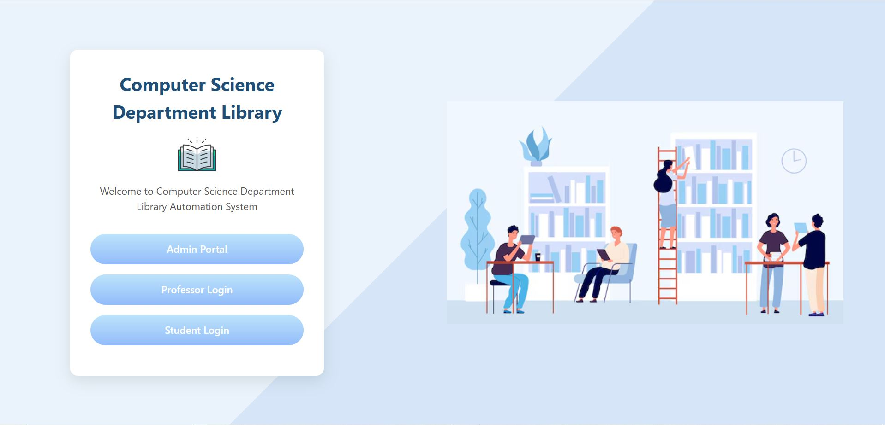
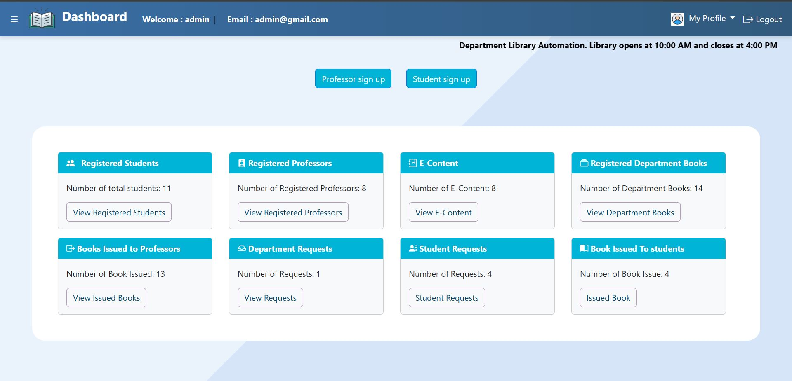
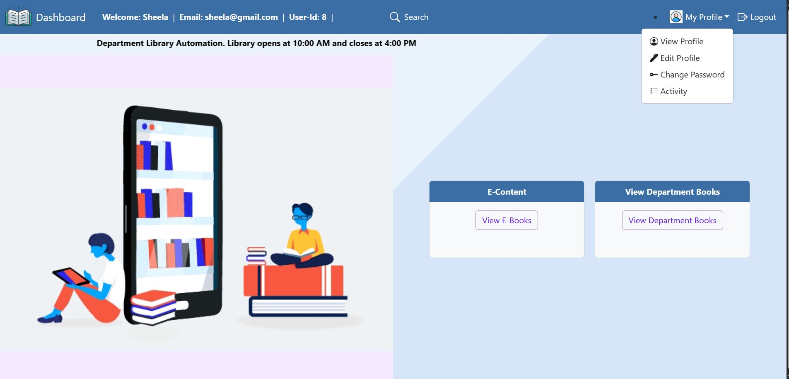
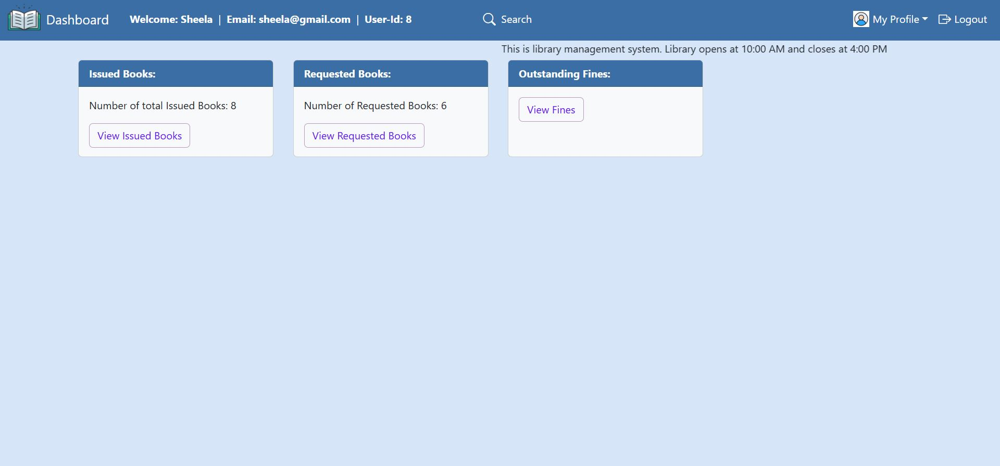
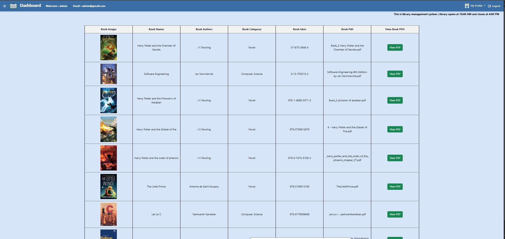

## 📚 Department Library Automation 
 PHP and MYSQL based project - This Project is mainly Focused on the managing the library activities by reducing the manual entries . This project allows the admin to manage the students and professor login and their requests and also issuing the books and handling the fine

 -----

 ## 🚀 Features
 - Admin , students and professor login system
 - Adding and managing of department and e-books 
 - Adding and managing of Category of books
 - It includes the pdf of e-books and user can load the available pdf's
 - Requesting and returning the book
 - Fine calculations of respective users

 -----

## 🛠️ Tech Stack
- **Frontend**: HTML, CSS, JavaScript  and Bootstrap
- **Backend**: PHP (XAMPP)  
- **Database**: MySQL  
- **Server**: Apache (via XAMPP) 

-----

## ⚡ Installation & Setup

### a. Clone the Repository
```bash
git clone https://github.com/Snehamn24/Department-Library-Automation.git
Move the folder to:
c:/xampp/htdocs/Department-Library-Automation

### b. Start XAMPP
-Start Apache and MySQL from the XAMPP Control Panel.

### c.Import Database
-Open phpMyAdmin
-Create a new database, e.g., library_db.
-Import the SQL file located in:
-database/library_db.sql

### d.Run the project
-http://localhost/Department-Library-Automation/
```

---

## 📸 Screenshots

### 🔐 Home Page


### 📊 Admin Dashboard


### 📊 Professor Dashboard 


### 📊 Professor Activity


### 📕 e-books


---

##  🙌 Contributors
- **Sneha M N** - Project Lead & Developer  

---

## 🙏 Acknowledgements
This project was built with help and inspiration from:  
- YouTube tutorials (for certain concepts/features)  
- ChatGPT (for guidance, explanations, and setup help)  


 
